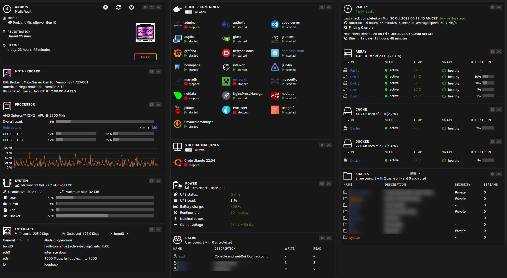

You know the specs already from my last post [Project Anubis](https://clyde.crimson.space/posts/project-anubis/). Here now more like an addon, more focused on the software. The OS running is [Unraid](https://unraid.net/). As the name already explains, no raid involved. Unraid builds an array out of disk you attach to it. It has, like raid, it's pro's and con's. Like all in life you need to build layers of security to protect whats precious.

I try to give you the idea behind it, without (most) of the usual technic tourette.

## The Array 

We have 4 harddisk drives, each 5TB in size.  
These are in an array means we can count them without any loss to a total of 20TB to our disposal.

Great, but what happens if a disk fails? As more disks you have, as more likely it is, that a disk will fail and is there any protection? Right now, no. Which is a bad thing.

## The Arrays Security

Parity drive magic!

The most simplified way to explain what is going on.  
This is a digital world, so it consists of zeros and ones.  
Which means a state can be even or odd nothing else.  

DISK1: 0  
DISK2: 1  
DISK3: 1  
DISK4: 1

State is odd, right, three times one is three and three is an odd number.  
Therefore the parity drive holds a 1 for odd.  
Let's assume DISK2 fails. The state flips to even contrary to our parity drive, which gives us odd.  
Now we add a new disk and all and thus we know it has to be odd a 1 is written to the drive.

Wait! Hold on. One 1 and all fine?  
Nope, simplified, as I said, all the sectors will be saved to the parity drive, so scale it up to the entire drive, and voilá, you can survive ONE disk failure.  
There's more to it, but for the sake of simplification - that's fine for now. 

## Docker (Container)

I rely heavily on containerization, and the build in system with "apps" on unraid is nearly perfect for a homelab setup, just in case I can fire up a Portainer container if I need more control, but for most of the time the build-in system is superb.

I do not want to annoy you with details, if you have questions what services I run, please get in touch with me. I can explain it further, but it would be to much for this post. Quick and dirty? Agree?

- Adminer  
Used as PHPMySQL Admin replacement, more lightweight. A My/MariaDB database frontend.
- Authelia  
To protect my pages with an additional layer of security.
- Code-Server
Yes vscode in your browser and access to my docker containers, which makes it super convinient to change stuff on the persistant drives.
- Duplicati
Additional layer of protection for the most important data on the machine. A backup system basically.
- Gitea  
As GitLab replacement. GitLab is far to bloated for my personal use. And gitea fits right in.
- glances
System monitoring which can be used via API on other systems. Pretty neat. But mostly stopped, consumes a lot of CPU time. Apart from that - great tool
- Grafana/InfluxDB/Telegraf  
Classical TIG stack which I hosted formally on Hetzner, but 60€/month for just a TIG stack which I cannot use right now is a lot. Therefore I try now to replicate this in my homelab.
- hetzner-ddns
Updates Hetzner DNS via API. A classical dynamic DNS setup. I am now able to use a subdomain and letsencrypt to secure services with a TLS certificate.
- HomeAssistant 
The new guy in the block, I replaced OpenHab3 with HomeAssistant for all IoT stuff. I just wanted to give it a test and I would never look back to OpenHab3, which I used for 5 years+. It's that good!
- homepage
A dashboard for my services. which can display additional information. Tried others, this one is ok. Homarr was ok, but more focuses on the .arr systems.
- Jellyfin
Our media vault. I really like to have a similar looking thing like Prime Video or Netflix at home. Takes time to update your data, but it's worth doing it.
- mariadb
Well, you need some database system in the end, I have some old blogs around, which I want to spool up again, if I ever find the time again for them.
- minecraft
Yes I moved my minecraft server from Hetzner to my local system. I am the only one playing - it's not a public server. 
- Mosquitto
MQTT broker a lightweight, publish and subscribe, m2m (machine2machine) protocol for message queue/message queuing service. Used mostly for IoT projects.
- netdata
A beast of a surviliance system for you homelab. So much data, with filters and a nice GUI. Seriously just have it, you can fire it up if you need it - but this collector holds a hell of a ton more than glances. Again CPU times will go up. Live monitoring is always CPU intensive.
- NGINX Proxy Manager (NPM)
Reverse Proxy for more security on my projects which might be exposed to the public internet. Together with authelia quite handy. NPM takes care of all the certificates via Let'S Encrypt and if you'd figured out how to set it up - it's pure bliss.
- Node-Red  
Javascript in a GUI. NOCode. If you need some data from somewhere, or create an automation for you home - this! Nothing else!
- Pi-Hole
Well of course we block adds and everything which might just eats up our bandwith for this idiotic industry.
- Portainer  
Managing Docker/DockerCompose in a GUI. Not much need anymore for it, but I used it for years and still in my work. 
- TinyMediaManager  
Tagging you media files made easy. This program was the reason to try Jellyfin and I would never miss it.

## Virtualization

Since my CPU is already heavily at work (9%-60%) with additional heavy workloads for internal backups and automisation I just use a single Ubuntu from time to time on my iPad.

## Uninterruptible power supply

If you run such a system, with TBs of data and services, you want to be prepared if the grid goes down.  
Right now that's a cheap Eaton USV Ellipse PRO 650 DIN. It is a battery and able to shut down your system if the batteries power level goes down. Seriously if you have a NAS, protect it!

## Mos Eisley Dashboard

[GetHomepage](https://gethomepage.dev)

## Price tag

Last not least, just to give you rough sum if you consider to build this on your own.  
Time for research and setup not included.

| Amount | Part | Single | Total |
|---|---|---|---|
|1|HP MicroServer||570€|
|5|Seagate Barracuda ST5000LM00 5TB HDDs| 121€ | 605€ |
|2|1 Port M.2 NVMe PCIe 3.0 X4 Riser Card| 15€ | 30€ |
|2|Samsung SSD 970 EVO Plus 2TB M.2 NVMe | 113€ | 226€ |
|1| Unraid Licence Plus (12 drives) || 89€|
|1|HP 870212-B21 MicroServer Gen10 Slim SFF Enable SATA Activation Kit||40€|
|1|Eaton USV Ellipse PRO 650 DIN||180€|
||||**1.740€**|